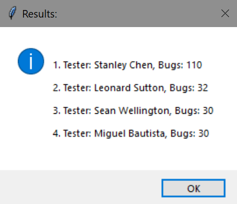

# Test Match

> A TKinter based matching system based on input CSV files and specified search criteria.

### Run the Application

1. Clone the repository: `git clone https://github.com/onocy/test_match.git`
2. Navigate into directory: `cd test_match`
3. Install dependencies: `pipenv install`
4. Activate shell: `pipenv shell`
5. Run file: `python match.py`

### Screenshots

